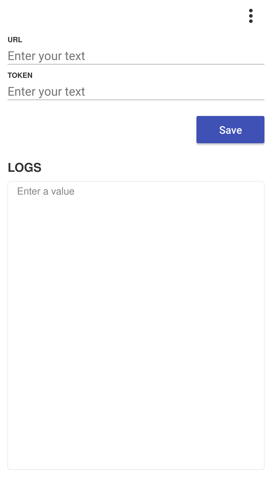
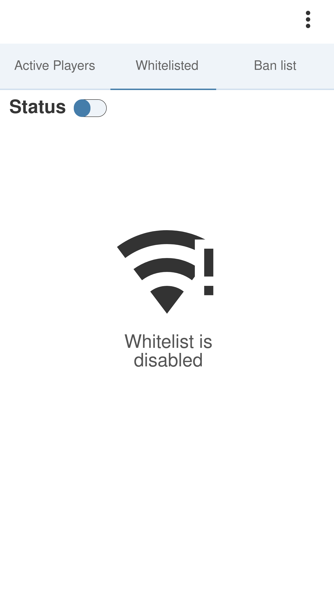
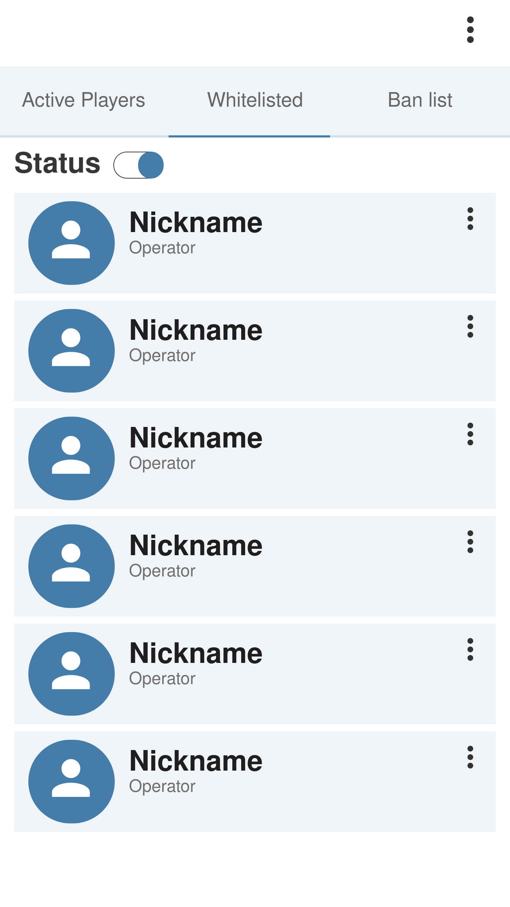
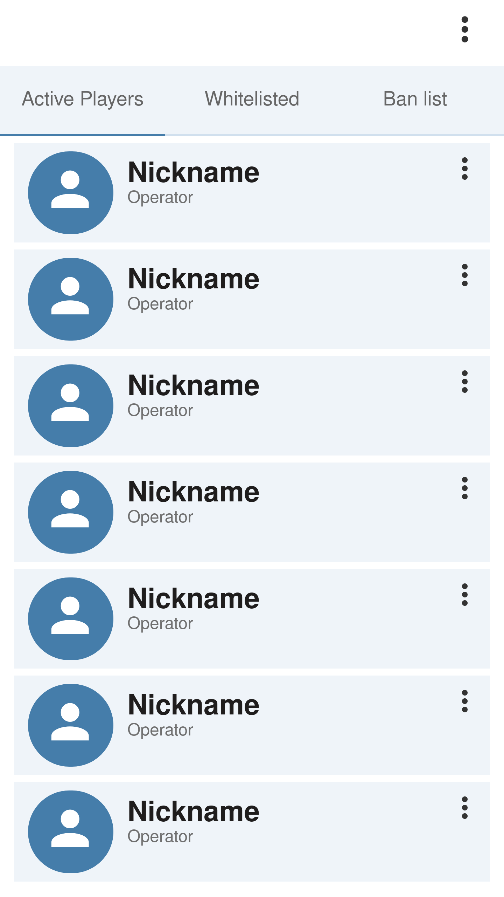

# 👥Project description

This is going to be an app that can perform several actions on Spigot Minecraft Server. To do so it will use REST API provided by my other project. Here is .

# ⌛️ Project status

Project hasn't started yet. I have only mockups at the moment.

